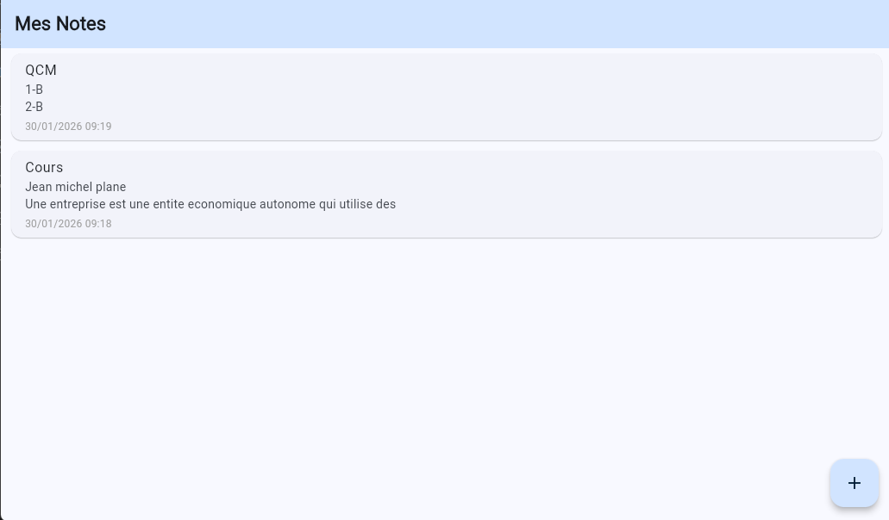

# Quick_Note

## Description
Application mobile permettant de créer, consulter, modifier et supprimer des notes rapidement.  
Les notes sont stockées localement sur l’appareil afin d’être accessibles à tout moment.  
Ce projet est le **onzième** du défi personnel **100 projets en 2026**.

---

## Objectifs du projet
- Implémenter un CRUD simple en local
- Gérer l’état de l’application en Flutter
- Sauvegarder des données localement
- Concevoir une interface mobile orientée productivité

---

## Plateforme
- Mobile

---

## Technologies utilisées
- Flutter
- Dart
- `shared_preferences` (stockage local)

---

## Fonctionnalités
- Création rapide d’une note
- Affichage de la liste des notes
- Modification d’une note existante
- Suppression d’une note
- Sauvegarde locale automatique

---

## Design & UX
- Interface simple et sans distraction
- Liste verticale de notes
- Bouton flottant pour ajouter une note
- Typographie lisible et contrastée

---

## Captures d’écran

---

## Ce que j’ai appris
- Gestion d’un CRUD en Flutter
- Utilisation de `shared_preferences`
- Mise à jour dynamique de l’UI
- Structuration d’une application mobile simple

---

## Améliorations possibles
- Recherche de notes
- Catégories ou tags
- Mode sombre
- Sauvegarde cloud

---

## Statut du projet
 **Projet terminé**